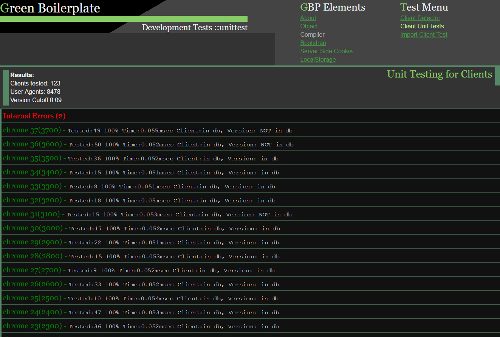
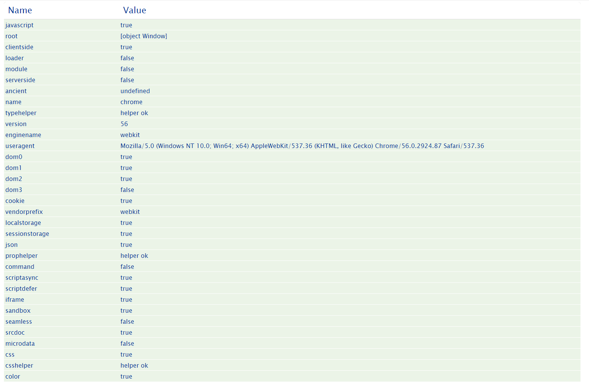
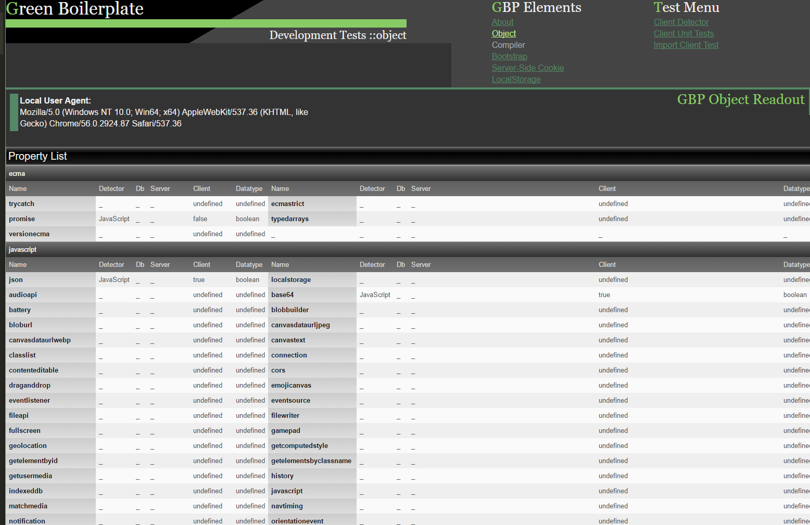

# 

...a boilerplate developed to implement Sustainable Web Design theory.

## The Problem

**Green Boilerplate** was a project I worked on from 2011 to 2014 alongside with developing a theory of Sustainable web design. At the time, typical websites downloaded polyfills to support browser function in a variety of inefficient ways. Support for older browsers was more important than today (2016+) and lead to part of the 'bloat' of web pages. 

**I was interested** in developing a boilerplate similar to HTML5 Boilerplate that only loaded feature tests and polyfills as needed. By being more efficient than say, Modernizr, the app would fullfill the "Green Ingredients" strategy for Sustainable Web Design.

**In addition**, I wanted to incorporate other features of Web Sustainability in the boilerplate. Besides JS feature detects, sever features, networks, site value to its audience (as described on [Tim Berners-Lee's Web Index Project](http://thewebindex.org/)) and even developer workflow influence the sustainability life cycle of web applications. The ultimate goal was to integrate all these expanded feature detects - client-side, server-side and network in a way allowing sustainability to be calculated. The goal was to produce useful "carbon footpring" and "environmental impact" [Life Cycle Analysis (LCA)](https://en.wikipedia.org/wiki/Life-cycle_assessment) computations for individual web projects.

## The Solution

**The key to the Green Boilerplate concept** was realizing that...

1. Older browsers had fixed user-agents, and weren't being updated. Their feature list was permanent.

2. Newer browsers retained features first added in earlier versions. Only new features need to be tested for by downloading the appropriate JS functions.

3. A server-side script could inject a JSON file directly into markup, reducing HTTP requests.

4. If features were detected server-side, it would also be possible to inject polyfill JS directly into the download, further reducing HTTP requests.

5. If the feature detects, both downloaded and local, could be stored on the user's computer using LocalStorage. That way, the next time the site was visited, the browser wouldn't even have to download the feature database.

## Benefits

**Websites** typically support older browsers by loading polyfill libraries. In order to conditionally load the polyfill, they a way of detecting browser features. By pre-computing features and adding the results on the server side, the size and more important, user-experienced delays.

**A Green Boilerplate system** would greatly reduce this issue. Sites could do comprehensive detection of 100s of features, and still have only a little extra JS added to their download, reducing page bloat.

**Ultimately**, Green Boilerplate was designed to replace custom feature detection scripts and generic systems such as [Modernizr](http://www.modernizr.com) with a solution suited to web sustainability.

## Features

1. **Create a database** of browser features, as well as client, network, and human factor features of web design, following [Sustainable Web Design](http://sustainablevirtualdesign.wordpress.com) theory. The feature database needed to be keyed to user-agents so browsers could be detected on the server. Only old browsers not being updated would be in the database. The database development system, is called [Green Boilerplate Initializr](http://github.com/pindiespace/green-boilerplate-initializr) and is found in this Github archive.

2. **Develop a system** which 'compiles' a mix of feature-detection functions and hard-coded feature values (stored in GBP-Initializr) into a JavaScript object. The GBP object would only feature-detect on the newest browsers, relying on the server to pre-fill a JSON library with features on old browsers. Site developers would compile a new GBP object as needed for their project from the Initializr database.

3. **Create an optimized HTML5-based boilerplate** which incorporated the GBP feature-detection script.

4. **Create client-side code** which allowed GBP to use LocalStorage for a stored feature list before going on the network.

4. **Using server-side detection**, have the server component of GBP inject appropriate polyfills as needed for older web browsers.

## Development and Challenges

**To develop GBP**, it was necessary to create a suite of old web browsers (which I did using a set of virtual machines). This allowed old browsers back to Internet Explorer 6 to be tested. IE6-IE8 are good examples of 'fossil' web browsers GBP targets - they are not being maintained or updated, but are still used by a few percent of web users (see [caniuse](http://caniuse.com). 

**The set of user-agents** describing IE8 is not changing either. So, if one does a Modernizr-style feature detect on IE8 one time, the resulting support for HTML, CSS, and JavaScript features will not change, and no re-detects are needed. This principle has been applied with success on the [Caniuse website](http://caniuse.com).

**So, web servers** can use this information to deliver a Modernizr-style script with all the feature tests that is much more compact. If a new browser is detected, the server would download a collection of JavaScript functions for feature detection. However, if a 'fossil' web browser is detected via its user-agent, the server can just download a list of its pre-determined features in a JSON file with some 'stub' JS. 

**This has a double benefit**. First, the amount of data being delivered by the website drops. Second, old browsers have a simpler time just reading pre-determined features, and the chance that they will crash by a 'modern' technique accidentally inserted into the feature-detection scripts is removed.

**Previous work** with user agents was hindered by less than inclusive databases, and an inability to accomodate new browsers. Green Boilerplate sought to solve this problem by implementing the following features:

1. **A database of older browsers** which might require polyfills, connecting their user-agents to an exhaustive list of feature detections. The database program in this archive is called [Green Boilerplate Initializer](http://github.com/pindiespace/green-boilerplate-initializr). GBP Initializr allowed feature data to be entered manually, as well as imported from databases like the [Caniuse](http://caniuse.com) and [Browserscope](http://browserscope.com) libraries. It also allowed import of active feature detects of browsers visiting the Green Boilerplate website. [Green Boilerplate Initializer](http://github.com/pindiespace/green-boilerplate-initializr) stores a complete list of feature detections and feature lists for older browsers.

The example below shows unit tests for the 100+ browsers and 1000+ versions that were incorporated into the database:

2. **A server-side script** which 'bootstrapped' the feature detection libraries, re-encoded as JSON. 

3. **A server-side script** which checked for a user agent match. If it was present, the pre-computed features (e.g. booleans for JavaScript API support) of the browser were inserted into a script similar to the Modernizr library. On the other hand, if the browser was new or unknown, the server script copied in the equivalent JavaScript feature detection function. The resulting JavaScript program was inserted into the HTML page.

To make things really fast, GBP implemented PHP's 'arrays on a disk' which allowed writing the features in a format allowing ultra-fast lookup.

4. **A compiler** which converted the GBP feature database into the 'arrays on a disk' format. This was implemented in [GBP Initializr](http://github.com/pindiespace/green-boilerplate-initializr).

5. **A concatenator** on the server which dynamically built a GBP JavaScript from the feature database, customized to the browser building the website, then injected the JS directly into the HTML page.

## Results

**The client-side GBP JavaScript** varies with each web browser accessing the website. If the browser is old and well-known (e.g. old versions of Internet Explorer) the downloaded script would be almost entirely hard-coded with boolean 'true' or 'false' indicating whether a feature was supported. In contrast, new or unknown browsers would have a GBP version which was mostly feature detection functions. 

The image below shows a complete feature readout by GBP prior to loading its JSON feature detection files.

5. **GBP also implemented a cache** using the HTML5 localStorage API. After the first GBP download, features, whether sent from the server or locally detected by the browser JS, were added to storage. When the page was reloaded, the client-side script would use the locally-stored feature list instead of running feature detects a second time.

6. **For development environments**, the results of local feature detects were relayed to the server via an Ajax routine, which could in turn incorporate them as hard-coded features keyed to the current user-agent of the browser. In this way, the percent of feature values would increase and the number of dynamic feature detects would decline over time.
 
A more comprehensive version of GBP was developed which included server-side and human factors:

## Conclusion

**Today, there is less need** for a GBP approach. Modern web browsers almost universally support web standards, so the need for feature detects and polyfill loads is much less than it was in 2011. In addition, the GBP system could be better implemented using server-side JavaScript rather than the PHP in which it was written.
